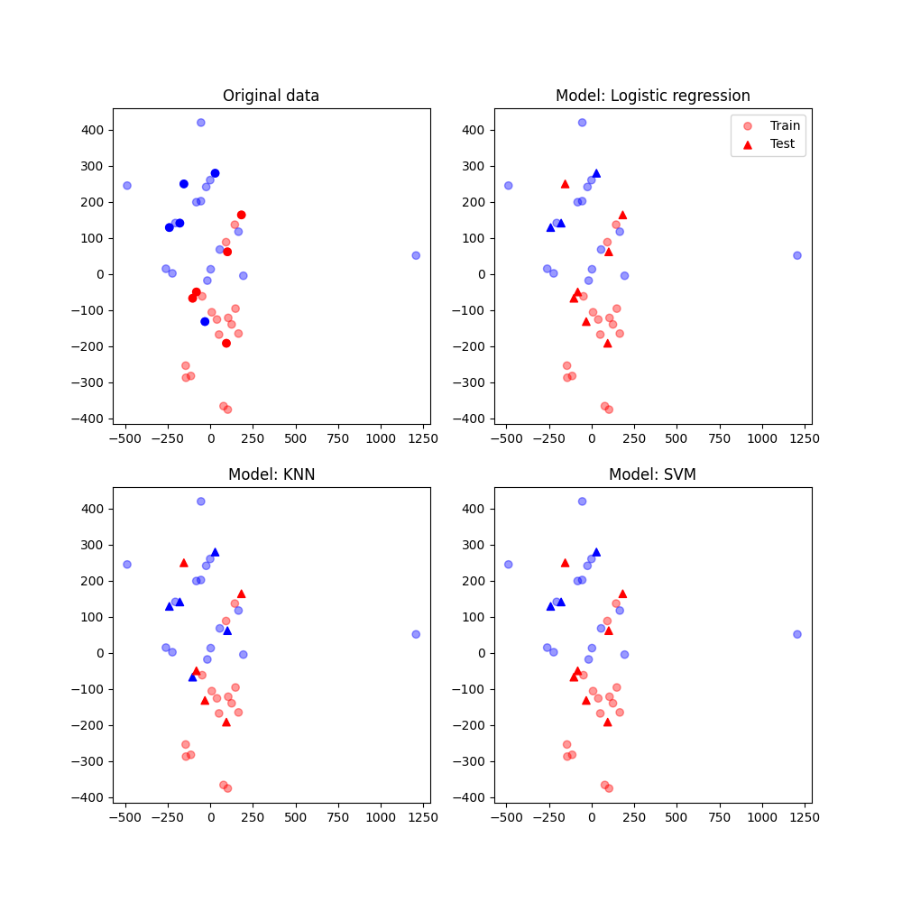

Industrial Machine Anomaly Detection
==============================

# Overview

This is an example project of a ML model for anomaly detection of an industrial machine based on sensors data.
Its purpose is for practicing the development of a ML project applying some best practices of development, including for example structured template, and unit testing. For that reason, the intention is to begin with the deployment of the simplest model, and update it when other models are proved to have better performance.

<small>Project based on the <a target="_blank" href="https://drivendata.github.io/cookiecutter-data-science/">cookiecutter data science project template</a></small>

**Project phase:** Development of the production version

# About the project
---

## 1. Main objective

Obtain a model which is capable of detecting abnormal behavior of an industrial machine (_not specified_) based on
sensors data.

## 2. Justification

The model can support the decision process of the staff accountable for the maintenance of the equipment.
With enough precision of prediction, the benefits would be:

- Reduction or near elimination of unscheduled equipment downtime caused by equipment or system failure;
- Increased labor utilization;
- Increased production capacity;
- Reduced maintenance costs;
- Increased equipment lifespan.

## 3. About the data

The data used in this study-case is available on the MathWorks platform, [here](https://de.mathworks.com/matlabcentral/fileexchange/90752-industrial-machinery-anomaly-detection). The original datafile is the MatLAB's proprietary file
format `.mat`. It is possible to read this file in Python, using the `scipy.io.loadmat` function. However, due to
the possibility of having problems with compatibility, here was decided to convert the file to a `.csv` format using
the simple routine in the `src/data/convert_matfile_csv.m` file, which runs only in the MatLAB environment.

The dataset contains sampled data from three different sensors assembled in the machine in analysis,
all of them apparently accelerometers. Unfortunately, a more detailed description about the machine and the
sensors are not available in the documentation. That means that important variables for the analysis, such as
_sampling frequency_, had to be assumed.

In the raw data available, there are 40 measurement samples, which is labeled as **Before** or **After** the maintenance
procedure. Given the nature of this problem, the number of samples is considerably small, which makes the training of a
robust and reliable model more difficult - and the challenge more attractive. On the other hand, the number of samples for
each class is equal, which is a sign that we don't have to deal with unbalanced classes (generally, that is the rule for
real cases).

Below a chart comparing two samples, one for each class.

## 4. Results

Although Anomaly Detection is normally done using unsupervised learning techniques, here we take advantage of the fact
that the data is labelled and apply supervised learning. In a future moment, I plan to study how'd be the performance
of a model trained using unsupervised learning.

As in any project of Data Science (given that the study of feasibility and prioritization between other projects is complete),
the first step is to understand the data available and execute an exploratory data analysis. After that, we dedicate a
time for Preprocessing, creating features that may be useful for our model. To see how those two steps where done in this
project, check the notebook [01_Exploratory_Analysis](notebooks/01_Exploratory_Analysis.ipynb).

In a nutshell, the following features where created during the Preprocessing steps. Using Basic and Higher order statistics:

- Mean and median of the signal in time domain;
- Kurtosis and Skewness of the signal in time domain.

Using techniques of signal processing:
- The magnitude and frequencies of the peaks responses extracted from the [Magnitude Response](https://de.mathworks.com/help/signal/ug/practical-introduction-to-frequency-domain-analysis.html;jsessionid=bf227c80f70faae950a35e066e89) of the signal in frequency domain;
- [Total Harmonic Distortion.](https://en.wikipedia.org/wiki/Total_harmonic_distortion)

Given that the intention of this project is to be a case-study, I restricted the Preprocessing step to just those features listed.
The total of features created by the preprocessing pipeline can achieve the number of 500, from which only 12 will be
selected using a feature selection method. In the future, I intend to expand the possibilities, creating more features
using automatic generators, such as [tsfresh](https://tsfresh.readthedocs.io/en/latest/).

Just to emphasize how sometimes the Preprocessing step is underrated, I refer to Ben Auffarth, in his [book](https://www.packtpub.com/product/Machine-Learning-for-Time-Series-with-Python/9781801819626),

> One reason for the relative silence on preprocessing could be that it's less glamorous than machine learning itself.
> It is, however, often the step that takes most time, sometimes estimated around 98% of the whole machine learning process.

### 4.1 First model

For our first model selection, I decided to test a set of simple models (see simple here, as an the idea that it is
not in the hype), namely Logistic Regression, K-Nearest Neighbors, and Support Vector Machine.
Three reasons for this choice: first, to have a performance reference when training more complex
models; Second, a simple model maintains the explainability, which is very important for models applied to engineering;
Third, simple models usually perform better on datasets with few samples, when compared to the more sophisticated models.

To compare the results between the models, two performance indicators are considered: the score using Nested-Cross Validation, and the confusion matrix of the testing dataset. Details on this matter can be found in the notebook [02_Model_Selection](notebooks/02_Model_Selection.ipynb).

Below, a chart comparing the mean scores (F-beta) for the three models.

Below, the confusion matrix based on the predictions of the testing dataset (10 samples).

Comparing the graphs above, one may notice that the three models had similar performance on the testing dataset (KNN was sligthly better). In any case, the most important aspect of any model for this application, which is to correctly classify all the machines with risk to failure, is presented.

However, the thing here is, that an attention to the low number of samples using as testing sample can be misleading. For that reason, we consider the distribution of the mean F-Beta score, which shows clearly that SVM had a superior performance.

Therefore, the best model until this moment, for with which the application will be developed, is the Support Vector Machine (SVM).

### 4.2 A visualization of the results

Another comprehensive way to visualize how the features is distributed in the multidimensional space is reducing its dimension (using the t-SNE method, for example), and plotting a scatter plot. Below, we see the result of this procedure, comparing the outputs of all trained models.

The graph shows how is possible to separate the major of the two classes samples.

### 4.3 Conclusion

- A set of features calculated on the signal in both time and frequency domain were of high importance to the performance of the models tested;

- Until the moment, the model with better performance is a Support Vector Machine, which input were 12 of the calculated features;

- In a real-life project, an observation about the low number of samples would be made, with the suggestion to collect more data.

Project Organization
------------

The following template is used as reference in the development of this project.

    ├── LICENSE
    ├── Makefile           <- Makefile with commands like `make data` or `make train`
    ├── README.md          <- The top-level README for developers using this project.
    ├── data
    │   ├── external       <- Data from third party sources.
    │   ├── interim        <- Intermediate data that has been transformed.
    │   ├── processed      <- The final, canonical data sets for modeling.
    │   └── raw            <- The original, immutable data dump.
    │
    ├── docs               <- A default Sphinx project; see sphinx-doc.org for details
    │
    ├── models             <- Trained and serialized models, model predictions, or model summaries
    │
    ├── notebooks          <- Jupyter notebooks. Naming convention is a number (for ordering),
    │                         the creator's initials, and a short `-` delimited description, e.g.
    │                         `1.0-jqp-initial-data-exploration`.
    │
    ├── references         <- Data dictionaries, manuals, and all other explanatory materials.
    │
    ├── reports            <- Generated analysis as HTML, PDF, LaTeX, etc.
    │   └── figures        <- Generated graphics and figures to be used in reporting
    │
    ├── requirements.txt   <- The requirements file for reproducing the analysis environment, e.g.
    │                         generated with `pip freeze > requirements.txt`
    │
    ├── setup.py           <- makes project pip installable (pip install -e .) so src can be imported
    ├── src                <- Source code for use in this project.
    │   ├── __init__.py    <- Makes src a Python module
    │   │
    │   ├── data           <- Scripts to download or generate data
    │   │   └── make_dataset.py
    │   │
    │   ├── features       <- Scripts to turn raw data into features for modeling
    │   │   └── build_features.py
    │   │
    │   ├── models         <- Scripts to train models and then use trained models to make
    │   │   │                 predictions
    │   │   ├── predict_model.py
    │   │   └── train_model.py
    │   │
    │   └── visualization  <- Scripts to create exploratory and results oriented visualizations
    │       └── visualize.py
    │
    └── tox.ini            <- tox file with settings for running tox; see tox.readthedocs.io

--------
